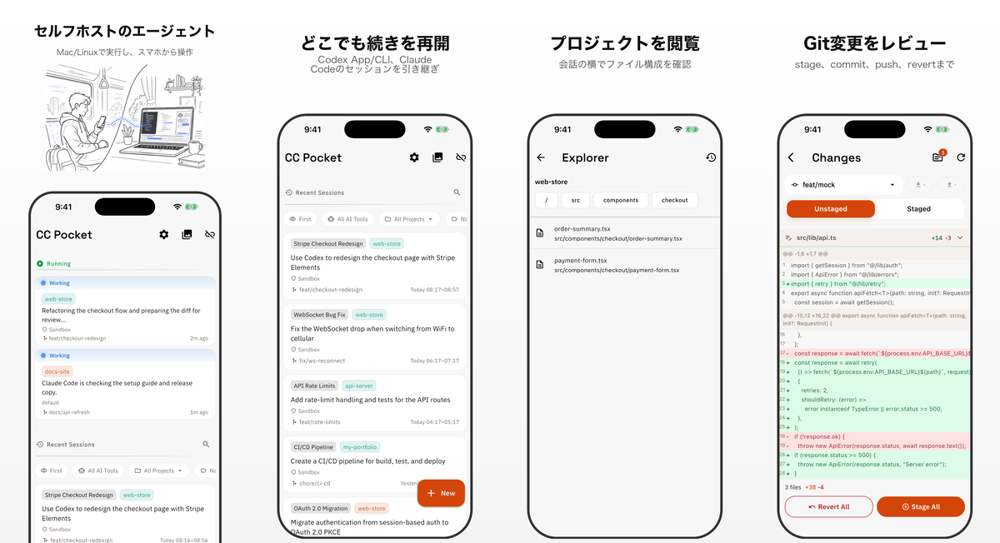

# CC Pocket

CC Pocket は、Codex / Claude のコーディングエージェントセッションを操作する
モバイル・デスクトップクライアントです。エージェントは自分の Mac / Linux
マシン上のセルフホスト Bridge Server で実行し、iPhone、iPad、Android、
macOS ネイティブアプリからセッション開始、承認、質問への回答、変更レビュー、
作業の引き継ぎを行えます。
Linux デスクトップ版は実験的ビルドとして GitHub Releases で配布しています。

[English README](README.md) | [简体中文版 README](README.zh-CN.md) | [한국어 README](README.ko.md)

<p align="center">
  
</p>

## インストール

1. セッションを実行するマシンに、少なくとも1つのエージェント CLI を入れます:
   [Codex](https://github.com/openai/codex) または [Claude Code](https://docs.anthropic.com/en/docs/claude-code)。
2. 同じマシンに [Node.js](https://nodejs.org/) 18 以上を入れます。
3. CC Pocket Bridge Server を起動します。

```bash
npx @ccpocket/bridge@latest
```

4. CC Pocket をインストールし、Bridge Server が表示する QR コードをスキャンします。
5. プロジェクトを選び、Codex / Claude を選択して、アプリからセッションを開始します。

| プラットフォーム | インストール |
|------------------|--------------|
| **iOS / iPadOS** | <a href="https://apps.apple.com/jp/app/cc-pocket-%E3%81%A9%E3%81%93%E3%81%A7%E3%82%82%E3%82%B3%E3%83%BC%E3%83%87%E3%82%A3%E3%83%B3%E3%82%B0/id6759188790"></a> |
| **Android** | <a href="https://play.google.com/store/apps/details?id=com.k9i.ccpocket"></a> |
| **macOS** | 最新の `.dmg` は [GitHub Releases](https://github.com/K9i-0/ccpocket/releases?q=macos) からダウンロードできます。`macos/v*` タグのリリースを探してください。 |
| **Linux（実験的）** | 最新の `.tar.gz` は [GitHub Releases](https://github.com/K9i-0/ccpocket/releases?q=linux) からダウンロードできます。`linux/v*` タグのリリースを探してください。 |

## 無料で利用できます

CC Pocket は無料で利用できます。もし開発ワークフローに役立ったら、アプリ内の Supporter から応援してもらえると助かります。いただいた支援は、AI ツール利用料や継続開発の維持に使われます。

## できること

- **どこからでも Codex / Claude を操作**: アプリからセッションを開始し、CLI / App で作った Recent Sessions も再開できます。スマホ、タブレット、Mac 間で状態を引き継げます。
- **承認待ちにすぐ対応**: コマンド、ファイル編集、MCP リクエスト、エージェントの質問に、モバイル向け UI で応答できます。
- **ワークスペースを確認して反映**: Explorer でプロジェクトファイルを閲覧し、git diff / 画像 diff、stage、commit、push、revert に対応します。
- **モバイルでもリッチにプロンプト作成**: Markdown、補完、音声入力、画像添付を使えます。
- **通信が不安定でも作業を継続**: メッセージ差分の復元、オフライン中の pending 送信、オンライン復帰後の自動再送に対応しています。
- **並列作業を安全に分離**: git worktree でセッションごとの作業ディレクトリを分けられます。
- **マシンを管理**: 保存済みホスト、QR、mDNS、Tailscale 接続、SSH start/stop/update、プッシュ通知に対応しています。
- **大きな画面でも使いやすく**: iPad / macOS / Linux ではチャット、Git、Explorer、画像、スクリーンショットを扱いやすいワークスペースレイアウトに適応します。

## 仕組み

CC Pocket は2つの部分で動きます。

```text
CC Pocket app  <->  自分のマシン上の Bridge Server  <->  Codex / Claude
```

アプリは操作画面です。Bridge Server は、プロジェクト、シェル、git リポジトリ、
エージェント CLI にアクセスできる自分のマシン上で動きます。コードはホスト型 IDE
へ移さず、自分のマシンに置いたまま使えます。

## リモートアクセス

同じネットワーク内では、QR コード、mDNS 自動発見、または手入力の
`ws://` / `wss://` URL で接続できます。

自宅やオフィスの外から使う場合は、Tailscale がおすすめです。

1. ホストマシンとスマホに [Tailscale](https://tailscale.com/) を入れる
2. 同じ tailnet に参加する
3. CC Pocket から `ws://<host-tailscale-ip>:8765` に接続する

常時起動するホストでは、Bridge Server をバックグラウンドサービスとして登録できます。

```bash
npx @ccpocket/bridge@latest setup
```

サービス化は macOS launchd と Linux systemd に対応しています。

## 補足

- Claude セッションには `@ccpocket/bridge` `1.25.0` 以上と `ANTHROPIC_API_KEY` が必要です。
  新規 Bridge インストールでは、Claude subscription login の `/login` はサポートしていません。
  詳細は [Claude 認証トラブルシューティング](docs/auth-troubleshooting.ja.md) を参照してください。
- CC Pocket はセルフホストと最小限のデータ収集を前提にしています。Supporter 購入は
  同じ Apple ID / Google アカウント内で復元できますが、ストア間では共有されません。
  詳細は [Supporter / Purchases](docs/supporter_ja.md) を参照してください。
- macOS のスクリーンショット取得には、Bridge Server を実行するターミナルアプリへの
  画面収録権限が必要です。
- CC Pocket は Anthropic / OpenAI と提携、後援、または公式連携しているものではありません。

## 開発

```bash
git clone https://github.com/K9i-0/ccpocket.git
cd ccpocket
npm install
cd apps/mobile && flutter pub get && cd ../..
```

よく使うコマンド:

| コマンド | 説明 |
|----------|------|
| `npm run bridge` | Bridge Server を開発モードで起動 |
| `npm run bridge:build` | Bridge Server をビルド |
| `npm run dev` | Bridge を再起動して Flutter アプリを起動 |
| `npm run test:bridge` | Bridge Server のテストを実行 |
| `cd apps/mobile && flutter test` | Flutter テストを実行 |
| `cd apps/mobile && dart analyze` | Dart 静的解析を実行 |

貢献方法は [CONTRIBUTING.md](CONTRIBUTING.md) を参照してください。

## ライセンス

[FSL-1.1-MIT](LICENSE): Source available。2028-03-17 に MIT へ移行します。

このリポジトリには `@ccpocket/bridge` 向けの Bridge Redistribution Exception が含まれます。
非公式でありサポート対象外であることを明示する限り、環境固有の fork や再配布が許可されています。
