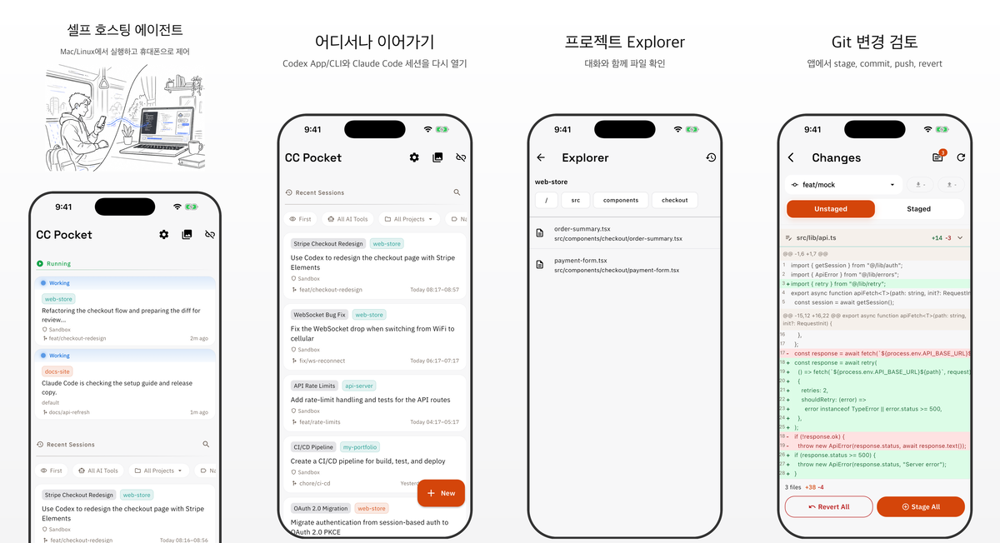

# CC Pocket

CC Pocket은 Codex / Claude 코딩 에이전트 세션을 제어하는 모바일 및 데스크톱 클라이언트입니다.
에이전트는 사용자의 Mac 또는 Linux 머신에 셀프 호스팅한 Bridge Server에서 실행하고,
iPhone, iPad, Android, macOS 네이티브 앱에서 세션 시작, 승인, 질문 응답, 변경 리뷰,
작업 이어받기를 할 수 있습니다.
실험적인 Linux 데스크톱 빌드도 GitHub Releases에서 제공합니다.

[English README](README.md) | [日本語 README](README.ja.md) | [简体中文 README](README.zh-CN.md)

<p align="center">
  
</p>

## 설치

1. 세션을 실행할 머신에 에이전트 CLI를 하나 이상 설치합니다:
   [Codex](https://github.com/openai/codex) 또는 [Claude Code](https://docs.anthropic.com/en/docs/claude-code).
2. 같은 머신에 [Node.js](https://nodejs.org/) 18 이상을 설치합니다.
3. CC Pocket Bridge Server를 시작합니다.

```bash
npx @ccpocket/bridge@latest
```

4. CC Pocket을 설치하고 Bridge Server가 출력한 QR 코드를 스캔합니다.
5. 프로젝트를 선택하고 Codex 또는 Claude를 고른 뒤 앱에서 세션을 시작합니다.

| 플랫폼 | 설치 |
|--------|------|
| **iOS / iPadOS** | <a href="https://apps.apple.com/us/app/cc-pocket-code-anywhere/id6759188790"></a> |
| **Android** | <a href="https://play.google.com/store/apps/details?id=com.k9i.ccpocket"></a> |
| **macOS** | 최신 `.dmg`는 [GitHub Releases](https://github.com/K9i-0/ccpocket/releases?q=macos)에서 다운로드할 수 있습니다. `macos/v*` 태그가 붙은 릴리스를 찾으세요. |
| **Linux(실험적)** | 최신 `.tar.gz`는 [GitHub Releases](https://github.com/K9i-0/ccpocket/releases?q=linux)에서 다운로드할 수 있습니다. `linux/v*` 태그가 붙은 릴리스를 찾으세요. |

## 무료로 사용할 수 있습니다

CC Pocket은 무료로 사용할 수 있습니다. 개발 워크플로에 도움이 된다면 앱 안에서 Supporter가 되어 주세요. Supporter 구매는 AI 도구 비용을 감당하고 지속적인 개발을 이어가는 데 사용됩니다.

## 할 수 있는 일

- **어디서든 Codex / Claude 제어**: 앱에서 세션을 시작하고, CLI / App에서 만든 Recent Sessions도 다시 열며, 휴대폰, 태블릿, Mac 사이에서 작업을 이어갈 수 있습니다.
- **승인 흐름을 놓치지 않기**: 모바일에 맞춘 UI로 명령, 파일 편집, MCP 요청을 승인하고 에이전트 질문에 응답할 수 있습니다.
- **워크스페이스 확인 후 반영**: Explorer로 프로젝트 파일을 살펴보고, git diff와 이미지 diff를 검토한 뒤 stage, commit, push, revert를 실행할 수 있습니다.
- **모바일에서도 풍부한 프롬프트 작성**: Markdown, 자동완성, 음성 입력, 이미지 첨부를 사용할 수 있습니다.
- **네트워크가 불안정해도 계속 작업**: 누락된 메시지 델타 복구, 오프라인 메시지 pending 처리, 재연결 후 자동 재전송을 지원합니다.
- **병렬 작업을 안전하게 분리**: git worktree로 세션별 작업 디렉터리를 나눌 수 있습니다.
- **머신 관리**: 저장된 호스트, QR 코드, mDNS 검색, Tailscale 연결, SSH start/stop/update, 푸시 알림을 지원합니다.
- **큰 화면에서도 편하게 사용**: iPad / macOS / Linux에서는 채팅, Git, Explorer, 이미지, 스크린샷을 다루기 쉬운 워크스페이스 레이아웃에 맞춰집니다.

## 작동 방식

CC Pocket은 두 부분으로 구성됩니다.

```text
CC Pocket app  <->  사용자의 머신에서 실행되는 Bridge Server  <->  Codex / Claude
```

앱은 조작 화면입니다. Bridge Server는 프로젝트, shell, git 저장소, 에이전트 CLI에 접근할 수 있는
사용자의 머신에서 실행됩니다. 코드는 호스팅 IDE로 옮기지 않고 자신의 머신에 그대로 둡니다.

## 원격 접속

같은 네트워크에서는 QR 코드, mDNS 자동 검색, 또는 직접 입력한 `ws://` / `wss://` URL로 연결할 수 있습니다.

집이나 사무실 밖에서 접속하려면 Tailscale 사용을 권장합니다.

1. 호스트 머신과 휴대폰에 [Tailscale](https://tailscale.com/)을 설치합니다
2. 같은 tailnet에 참여합니다
3. CC Pocket에서 `ws://<host-tailscale-ip>:8765`로 연결합니다

항상 켜두는 호스트라면 Bridge Server를 백그라운드 서비스로 등록할 수도 있습니다.

```bash
npx @ccpocket/bridge@latest setup
```

서비스 설정은 macOS launchd와 Linux systemd를 지원합니다.

## 참고

- Claude 세션에는 `@ccpocket/bridge` `1.25.0` 이상과 `ANTHROPIC_API_KEY`가 필요합니다.
  새 Bridge 설치에서는 Claude subscription login의 `/login`을 지원하지 않습니다.
  자세한 내용은 [Claude 인증 문제 해결](docs/auth-troubleshooting.ko.md)을 확인하세요.
- CC Pocket은 셀프 호스팅과 최소한의 데이터 수집을 전제로 설계되었습니다. Supporter 구매는
  같은 Apple ID / Google 계정 안에서 복원할 수 있지만, 스토어 간에는 공유되지 않습니다.
  자세한 내용은 [Supporter / Purchases](docs/supporter_ko.md)를 확인하세요.
- macOS 스크린샷 캡처에는 Bridge Server를 실행하는 터미널 앱에 화면 기록 권한이 필요합니다.
- CC Pocket은 Anthropic 또는 OpenAI와 제휴, 보증 또는 공식 관계가 없습니다.

## 개발

```bash
git clone https://github.com/K9i-0/ccpocket.git
cd ccpocket
npm install
cd apps/mobile && flutter pub get && cd ../..
```

자주 쓰는 명령:

| 명령 | 설명 |
|------|------|
| `npm run bridge` | Bridge Server를 개발 모드로 시작 |
| `npm run bridge:build` | Bridge Server 빌드 |
| `npm run dev` | Bridge를 재시작하고 Flutter 앱 실행 |
| `npm run test:bridge` | Bridge Server 테스트 실행 |
| `cd apps/mobile && flutter test` | Flutter 테스트 실행 |
| `cd apps/mobile && dart analyze` | Dart 정적 분석 실행 |

기여 방법은 [CONTRIBUTING.md](CONTRIBUTING.md)를 확인하세요.

## 라이선스

[FSL-1.1-MIT](LICENSE): 소스 사용 가능. 2028-03-17에 MIT로 전환됩니다.

이 저장소에는 `@ccpocket/bridge`를 위한 Bridge Redistribution Exception이 포함되어 있습니다.
비공식이며 지원 대상이 아님을 명확히 표시하는 한, 환경별 fork나 재배포가 허용됩니다.
