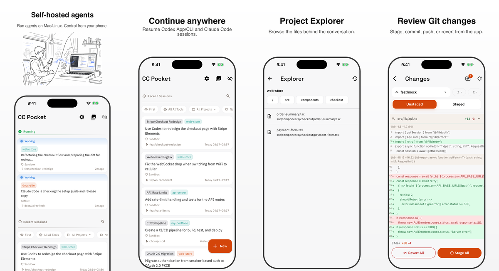

# CC Pocket

CC Pocket is a mobile and desktop app for controlling Codex and Claude coding-agent sessions.
Run the agents through a self-hosted Bridge Server on your own Mac or Linux machine,
then start sessions, approve actions, answer questions, review changes, and pick up work
from iPhone, iPad, Android, or the native macOS app.
Experimental Linux desktop builds are also available from GitHub Releases.

[日本語版 README](README.ja.md) | [简体中文版 README](README.zh-CN.md) | [한국어 README](README.ko.md)

<p align="center">
  
</p>

## Install

1. Install at least one agent CLI on the machine that will run your sessions:
   [Codex](https://github.com/openai/codex) or [Claude Code](https://docs.anthropic.com/en/docs/claude-code).
2. Install [Node.js](https://nodejs.org/) 18 or newer on that same machine.
3. Start the CC Pocket Bridge Server:

```bash
npx @ccpocket/bridge@latest
```

4. Install CC Pocket and scan the QR code printed by the Bridge Server.
5. Pick a project, choose Codex or Claude, and start coding from the app.

| Platform | Install |
|----------|---------|
| **iOS / iPadOS** | <a href="https://apps.apple.com/us/app/cc-pocket-code-anywhere/id6759188790"></a> |
| **Android** | <a href="https://play.google.com/store/apps/details?id=com.k9i.ccpocket"></a> |
| **macOS** | Download the latest `.dmg` from [GitHub Releases](https://github.com/K9i-0/ccpocket/releases?q=macos). Look for releases tagged `macos/v*`. |
| **Linux (experimental)** | Download the latest `.tar.gz` from [GitHub Releases](https://github.com/K9i-0/ccpocket/releases?q=linux). Look for releases tagged `linux/v*`. |

## Free to Use

CC Pocket is free to use. If it helps your workflow, please consider becoming a Supporter in the app. Supporter purchases help cover development and AI tooling costs.

New to mobile coding agents? See [How to run Codex from iPhone or Android](https://k9i-0.github.io/ccpocket/how-to-run-codex-from-iphone-android/).

## What You Can Do

- **Control Codex and Claude anywhere**: start sessions from the app, resume recent sessions created in the CLI or app, and move between phone, tablet, and Mac without losing context.
- **Stay in the approval loop**: approve commands, file edits, MCP requests, and agent questions from a mobile-first UI without returning to your keyboard.
- **Explore and review the workspace**: browse project files with Explorer, inspect git diffs and image diffs, stage changes, commit, push, or revert them.
- **Write rich prompts on mobile**: use Markdown, completions, voice input, and image attachments.
- **Keep working on spotty networks**: recover missed streaming updates, queue outgoing messages while offline, and resend automatically after reconnecting.
- **Work in parallel safely**: run sessions in separate git worktrees and keep long-running work isolated.
- **Manage your machines**: save hosts, connect with QR codes or mDNS discovery, use Tailscale, start/stop/update over SSH, and receive push notifications.
- **Use larger screens when helpful**: CC Pocket adapts to iPad, macOS, and Linux with workspace layouts for chat, Git, Explorer, screenshots, and images.

## How It Works

CC Pocket has two parts:

```text
CC Pocket app  <->  Bridge Server on your machine  <->  Codex / Claude
```

The app is the interface you use. The Bridge Server runs locally on the machine that
has access to your projects, shell, git repository, and agent CLI. Your code stays
on your own machine instead of moving into a hosted IDE.

## Remote Access

On the same network, connect with the QR code, mDNS discovery, or a manual
`ws://` / `wss://` URL.

For access away from home or the office, Tailscale is the recommended setup:

1. Install [Tailscale](https://tailscale.com/) on your host machine and phone.
2. Join the same tailnet.
3. Connect to `ws://<host-tailscale-ip>:8765` from CC Pocket.

For an always-on host, the Bridge Server can also be registered as a background service:

```bash
npx @ccpocket/bridge@latest setup
```

Service setup supports macOS launchd and Linux systemd.

## Notes

- Claude sessions require `@ccpocket/bridge` `1.25.0` or newer and an `ANTHROPIC_API_KEY`.
  Claude subscription login via `/login` is not supported for new Bridge installs.
  See [Claude authentication troubleshooting](docs/auth-troubleshooting.md).
- CC Pocket is designed around self-hosting and minimal data collection. Supporter purchases
  restore within the same Apple ID or Google account, but do not sync across stores.
  See [Supporter / Purchases](docs/supporter.md).
- Screenshot capture on macOS requires Screen Recording permission for the terminal app
  running the Bridge Server.
- CC Pocket is not affiliated with, endorsed by, or associated with Anthropic or OpenAI.

## Development

```bash
git clone https://github.com/K9i-0/ccpocket.git
cd ccpocket
npm install
cd apps/mobile && flutter pub get && cd ../..
```

Common commands:

| Command | Description |
|---------|-------------|
| `npm run bridge` | Start Bridge Server in dev mode |
| `npm run bridge:build` | Build the Bridge Server |
| `npm run dev` | Restart Bridge and launch the Flutter app |
| `npm run test:bridge` | Run Bridge Server tests |
| `cd apps/mobile && flutter test` | Run Flutter tests |
| `cd apps/mobile && dart analyze` | Run Dart static analysis |

See [CONTRIBUTING.md](CONTRIBUTING.md) for contribution guidelines.

## License

[FSL-1.1-MIT](LICENSE): Source available. Converts to MIT on 2028-03-17.

The repository includes a Bridge Redistribution Exception for `@ccpocket/bridge`.
Unofficial Bridge redistributions and environment-specific forks are allowed, as long as
they remain clearly unofficial and unsupported.
