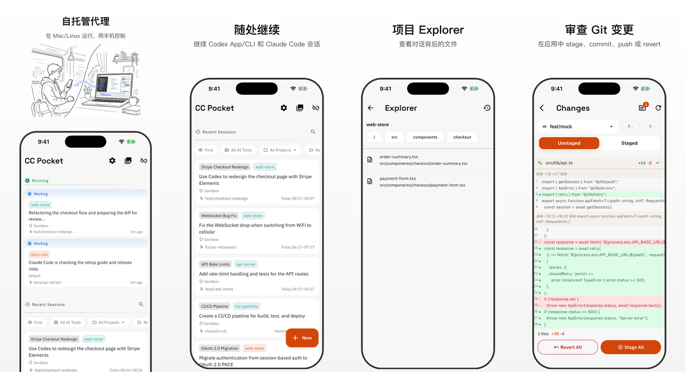

# CC Pocket

CC Pocket 是一款用于控制 Codex / Claude 编程代理会话的移动与桌面客户端。
代理通过你自己的 Mac 或 Linux 主机上的自托管 Bridge Server 运行，你可以从
iPhone、iPad、Android 或原生 macOS App 启动会话、批准操作、回答问题、
审查变更并继续工作。
实验性的 Linux 桌面版也会通过 GitHub Releases 发布。

[English README](README.md) | [日本語 README](README.ja.md) | [한국어 README](README.ko.md)

<p align="center">
  
</p>

## 安装

1. 在运行会话的主机上安装至少一个代理 CLI：
   [Codex](https://github.com/openai/codex) 或 [Claude Code](https://docs.anthropic.com/en/docs/claude-code)。
2. 在同一台主机上安装 [Node.js](https://nodejs.org/) 18 或更高版本。
3. 启动 CC Pocket Bridge Server：

```bash
npx @ccpocket/bridge@latest
```

4. 安装 CC Pocket，并扫描 Bridge Server 打印出的二维码。
5. 选择项目，再选择 Codex 或 Claude，然后从 App 启动会话。

| 平台 | 安装 |
|------|------|
| **iOS / iPadOS** | <a href="https://apps.apple.com/us/app/cc-pocket-code-anywhere/id6759188790"></a> |
| **Android** | <a href="https://play.google.com/store/apps/details?id=com.k9i.ccpocket"></a> |
| **macOS** | 从 [GitHub Releases](https://github.com/K9i-0/ccpocket/releases?q=macos) 下载最新 `.dmg`。请查找带有 `macos/v*` 标签的发行版。 |
| **Linux（实验性）** | 从 [GitHub Releases](https://github.com/K9i-0/ccpocket/releases?q=linux) 下载最新 `.tar.gz`。请查找带有 `linux/v*` 标签的发行版。 |

## 免费使用

CC Pocket 可以免费使用。如果它对你的开发流程有帮助，欢迎在应用内成为 Supporter。Supporter 购买会用于覆盖 AI 工具费用，并帮助持续开发。

## 可以做什么

- **随时控制 Codex / Claude**：从 App 启动会话，也能恢复 CLI / App 创建的 Recent Sessions，并在手机、平板和 Mac 之间继续工作。
- **及时处理审批**：通过移动端优先的 UI 批准命令、文件编辑、MCP 请求，并回答代理问题。
- **查看工作区并落地变更**：用 Explorer 浏览项目文件，查看 git diff 和图片 diff，并执行 stage、commit、push 或 revert。
- **在移动端编写丰富提示词**：支持 Markdown、补全、语音输入和图片附件。
- **在网络不稳定时继续工作**：支持恢复消息增量、暂存离线消息，并在重新联网后自动重发。
- **安全地并行工作**：用 git worktree 将不同会话隔离到独立工作目录。
- **管理你的机器**：支持保存主机、二维码、mDNS、Tailscale 连接、SSH start/stop/update 和推送通知。
- **适配大屏工作流**：在 iPad / macOS / Linux 上使用适合聊天、Git、Explorer、图片和截图的工作区布局。

## 工作方式

CC Pocket 由两部分组成：

```text
CC Pocket app  <->  你自己机器上的 Bridge Server  <->  Codex / Claude
```

App 是操作界面。Bridge Server 在能够访问你的项目、shell、git 仓库和代理 CLI
的主机上运行。你的代码留在自己的机器上，不需要迁移到托管 IDE。

## 远程访问

在同一网络内，你可以使用二维码、mDNS 自动发现，或手动输入
`ws://` / `wss://` URL 连接。

如果要从家或办公室之外访问，推荐使用 Tailscale：

1. 在主机和手机上安装 [Tailscale](https://tailscale.com/)
2. 加入同一个 tailnet
3. 从 CC Pocket 连接 `ws://<host-tailscale-ip>:8765`

对于长期在线的主机，也可以把 Bridge Server 注册为后台服务：

```bash
npx @ccpocket/bridge@latest setup
```

服务化设置支持 macOS launchd 和 Linux systemd。

## 说明

- Claude 会话需要 `@ccpocket/bridge` `1.25.0` 或更高版本，以及 `ANTHROPIC_API_KEY`。
  新的 Bridge 安装不支持通过 `/login` 使用 Claude subscription login。
  详情请见 [Claude 认证排查](docs/auth-troubleshooting.zh-CN.md)。
- CC Pocket 围绕自托管和最少数据收集设计。Supporter 购买可以在同一个
  Apple ID / Google 账号内恢复，但不会在不同商店之间同步。
  详情请见 [Supporter / Purchases](docs/supporter_zh.md)。
- macOS 截图功能需要为运行 Bridge Server 的终端应用授予屏幕录制权限。
- CC Pocket 与 Anthropic 或 OpenAI 没有任何关联，也未获得其认可、赞助或官方合作。

## 开发

```bash
git clone https://github.com/K9i-0/ccpocket.git
cd ccpocket
npm install
cd apps/mobile && flutter pub get && cd ../..
```

常用命令：

| 命令 | 说明 |
|------|------|
| `npm run bridge` | 以开发模式启动 Bridge Server |
| `npm run bridge:build` | 构建 Bridge Server |
| `npm run dev` | 重启 Bridge 并启动 Flutter App |
| `npm run test:bridge` | 运行 Bridge Server 测试 |
| `cd apps/mobile && flutter test` | 运行 Flutter 测试 |
| `cd apps/mobile && dart analyze` | 运行 Dart 静态分析 |

贡献指南请见 [CONTRIBUTING.md](CONTRIBUTING.md)。

## 许可证

[FSL-1.1-MIT](LICENSE): 源码可用，并将于 2028-03-17 自动转换为 MIT。

本仓库包含适用于 `@ccpocket/bridge` 的 Bridge Redistribution Exception。
只要明确标注为非官方且不提供支持，就允许面向特定环境制作 fork 或进行再分发。
